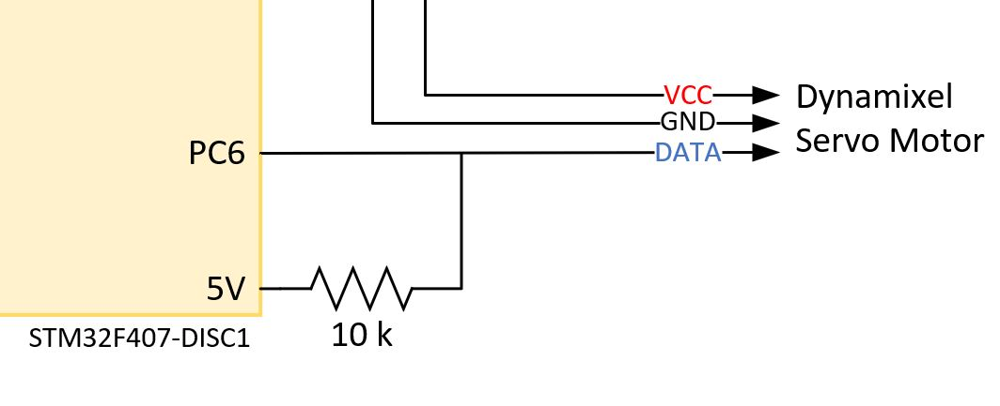

# Robotis Dynamixel Series Library for STM32

## Abstract
- This library is based on the communication datasheet provided by Robotis's official website and is compatible with the Dynamixel protocol 1.0 with the TTL half duplex asynchronous serial communication.

- This library is developed based on the STM32 HAL library and is designed for use with the STM32F407-DISC1 development board and Mx series servo motors. If you have specific hardware requirements or need to use a different standard library, please make the necessary modifications accordingly.

## Instructions For Use

- First, initialize the handle for communication processing and initialize the servo motor by defining the motor structure as shown below for initialization arguments.

    ```C
        Dynamixel_SERVO Servo = {
            //  for one servo motor.
            .ID = 0
        };
        Dynamixel_SERVO Servo[2] = {
            //  for multiple servo motor.
            {.ID = 0},
            {.ID = 1}
        };

        Dynamixel_Init_Handle(&huart6); // Initialize the handle for communication.

        Dynamixel_Servo_Init(&Servo, 1); // Initialize one servo motor.
        Dynamixel_Servo_Init(Servo, 2); // Initialize multiple servo motor.
    ```
    The data obtained from the motor response will be directly stored in the servo motor structure provided as an argument. You can retrieve the data by calling the appropriate functions when needed.

- In terms of circuit configuration, due to the use of half-duplex UART, only one data line will be pulled out from the STM32 board. Both transmission and reception will use the same channel. The data line is pulled up to a high level using the 5V pin and a 10k ohm pull-up resistor.
  
  

- NOTICE:
  1. ...
## Example
- 
   | STM32 PIN | Device PIN |
  | --- | --- |
  |PD8|PC RX|
  |PD9|PC TX|
  |PC6|MX28 Data Pin|
  |5V |Pull-up resistor|

## Reference
- [Dynamixel Protocol 1.0]
- [MX28 Series Control Table]

[Dynamixel Protocol 1.0]:https://emanual.robotis.com/docs/en/dxl/protocol1/
[MX28 Series Control Table]:https://emanual.robotis.com/docs/en/dxl/mx/mx-28/#control-table
